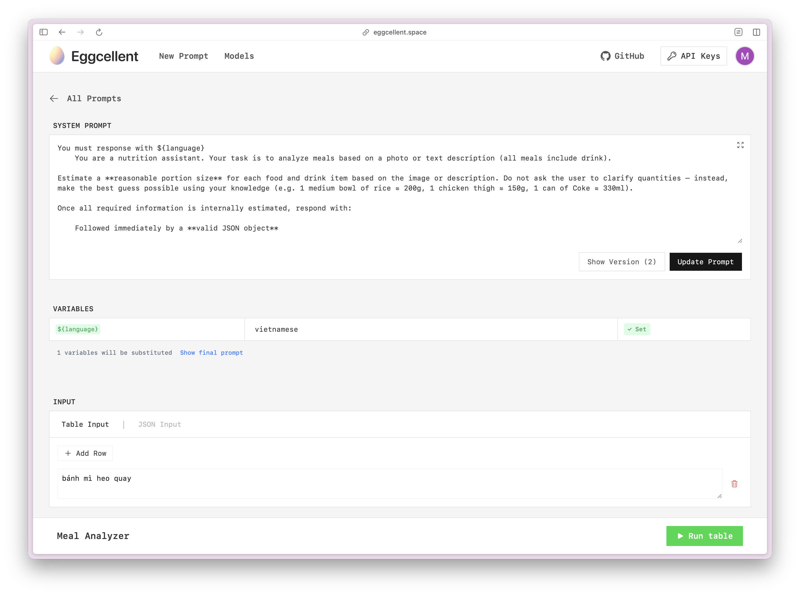

<p align="center">
  <a href="https://eggcellent.space">
    <picture>
      <source srcset="public/logo.png">
      
    </picture>
  </a>
</p>

<p align="center">A powerful, local-first playground to test and optimize AI prompts — with version control, multi-model testing, batch input, and schema validation.</p>



## ✨ Features

- Multi-Model Testing: Compare responses from OpenAI, Anthropic, Google, and xAI models side by side

- Prompt Version Control: Track and manage different versions of your prompts

- Batch testing: test prompts with different inputs

- Structured Output Validation: Ensure your prompts produce the expected format

- Multi-Modal Support: Test prompts with both text and images

- Local-First Security: Your API keys and prompts stay secure in your browser

## 🔑 API Key Management

- API keys are stored securely in your browser's local storage
- Keys are never sent to any server
- No data is sent to external servers except direct API calls to AI providers
- All processing happens client-side

## 🛠️ Development

### Prerequisites

- Node.js 18+
- npm or yarn

## 🚀 Quick Start

1. Clone the repository:

```bash
git clone https://github.com/yourusername/eggcellent.git
cd eggcellent
```

2. Install dependencies:

```bash
npm install
```

3. Start the development server:

```bash
npm run dev
```

4. Open [http://localhost:5173](http://localhost:5173) in your browser

### Tech Stack

- ⚛️ React + TypeScript
- 🏃‍♂️ Vite
- 🎨 TailwindCSS
- 📦 Zustand (State Management)
- 🧪 AI SDK Vercel

## 📄 License

This project is licensed under the MIT License - see the [LICENSE](LICENSE) file for details.
